#  基于Spring Boot-Vue的农产品销售-供销-供需发布系统-代码设计与实现-前后端分离一键部署版

### 软件技术架构
1. 后端: Spring Boot2.5.3、Mybatis
2. 前端：Vue2.0
3. 数据库：Mysql、Redis
4. 部署: Docker、Docker-compose

### 在线展示

1. [ **bilibili演示视频（B站）记得一赞三连哦！ **  ](https://www.bilibili.com/video/BV16r42177r8/?spm_id_from=333.999.0.0&vd_source=eac6949bd2385c66c0a975d5765c99a5)
2. [   **系统使用演示视频** ](https://www.bilibili.com/video/BV16r42177r8/?spm_id_from=333.999.0.0&vd_source=eac6949bd2385c66c0a975d5765c99a5)

### 简介
农产品销售系统，农产品供需关系发布系统，求购农产品，发布农产品信息，网上销售购物农产品系统

### 功能介绍

1. 农产品信息发布，商品发布，农产品售卖。
1. 发布求购需求，发布自己需要的商品信息。
1. 购物车，自己购买的商品可以加入购物车.
1. 引入支付宝在线支付系统。
1. 商家可以查看购买的订单，进行发货。
1. 农业知识模块，进行知识学习。
1. 用户管理，用户角色分为普通用户，专家学者，管理员。

    

### 使用说明
1. 本项目开源免费，可以自行拉取代码，项目启动运行若有疑问可以联系作者咨询
2. 本代码存在许多不足，欢迎大佬提交代码合并请求
3.   **本代码严禁自行售卖，从事任何商业行为，谢谢合作** 
4.   **若有侵权信息请联系作者删除，您的点赞收藏是我们前进的动力** 
5.   **作者QQ：3300755918** 

### 功能详情图

[   **系统使用演示视频** ](https://www.bilibili.com/video/BV16r42177r8/?spm_id_from=333.999.0.0&vd_source=eac6949bd2385c66c0a975d5765c99a5)

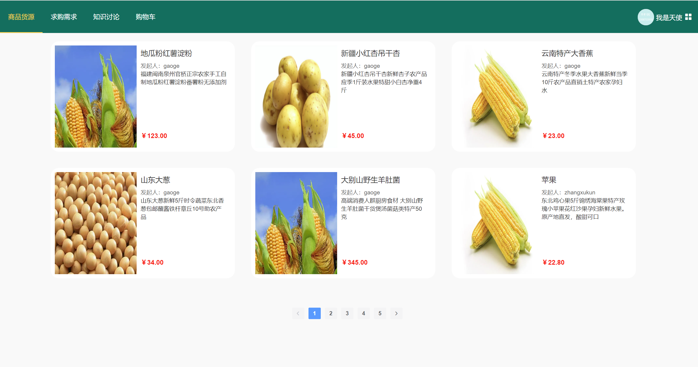
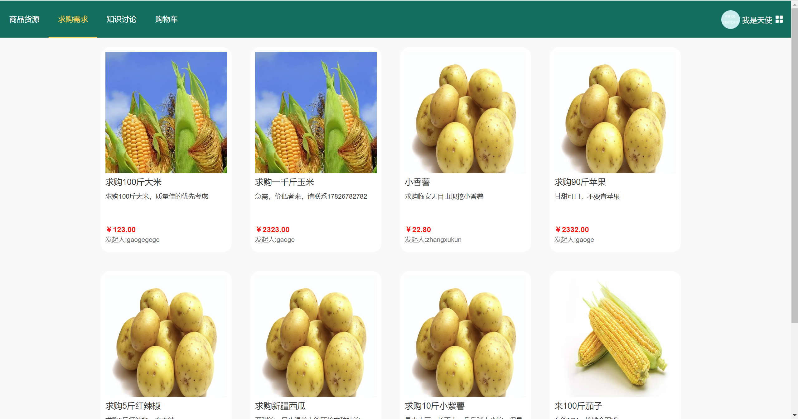
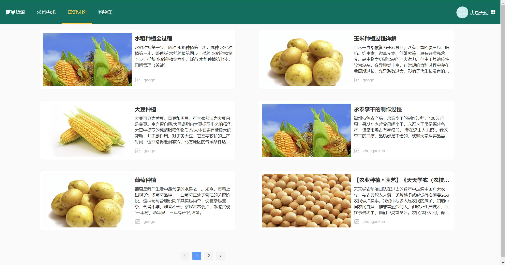
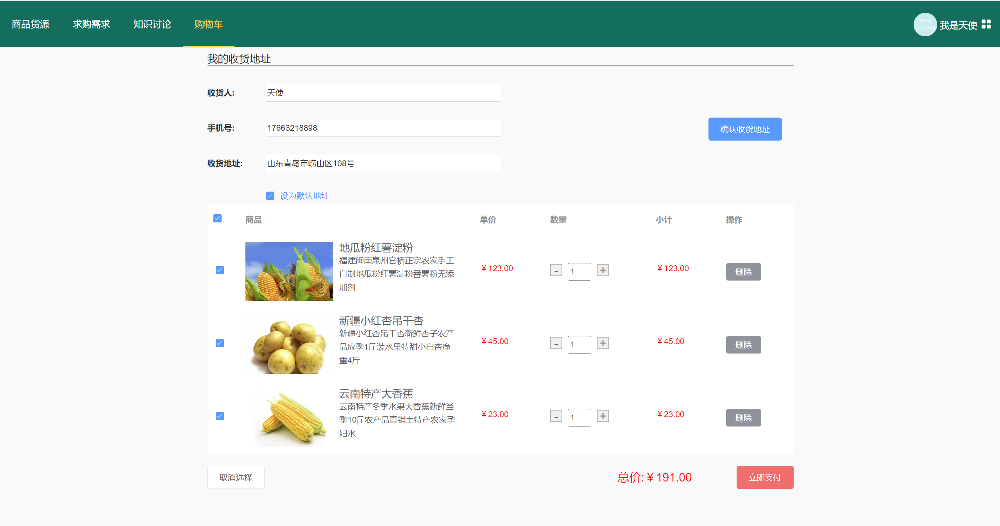
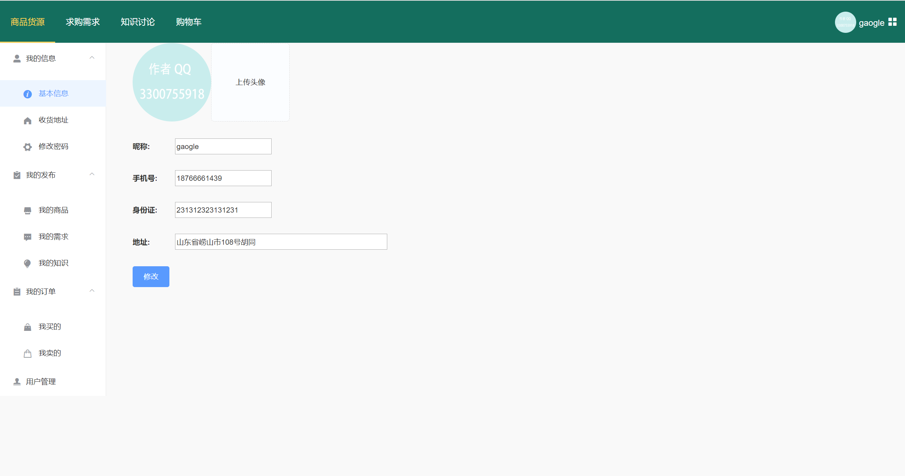
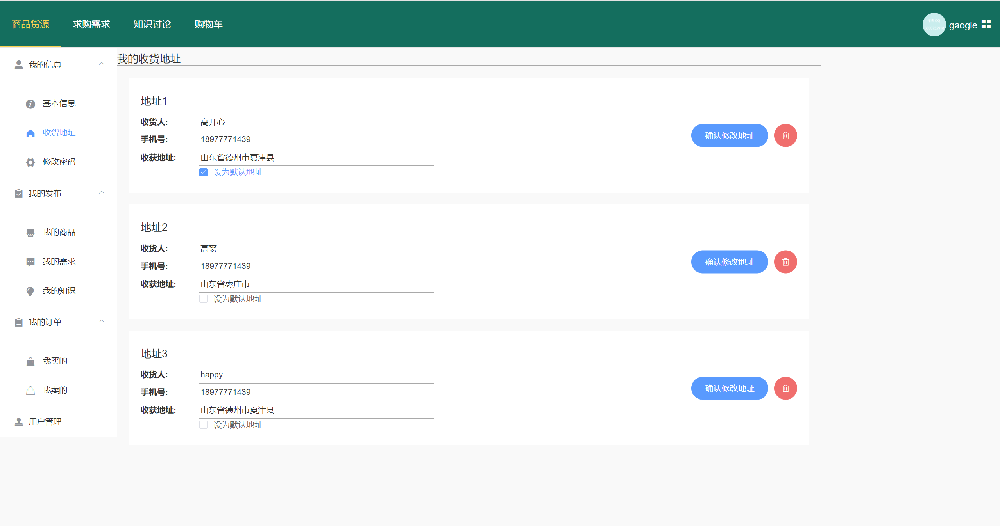
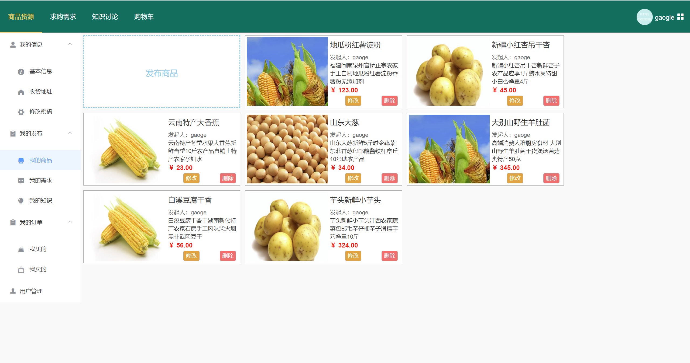
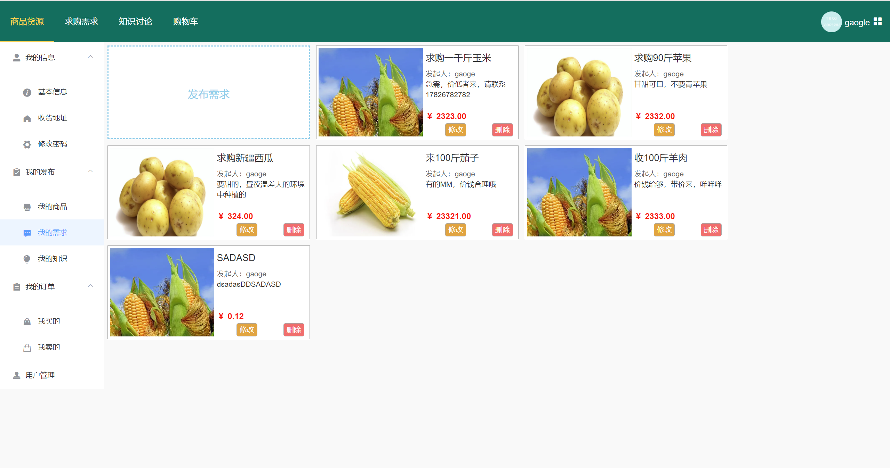
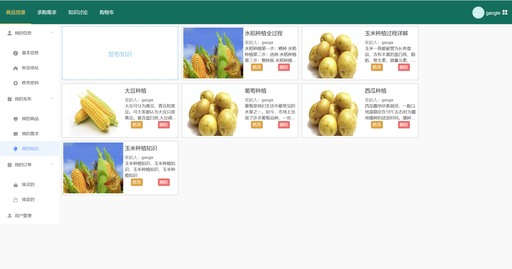

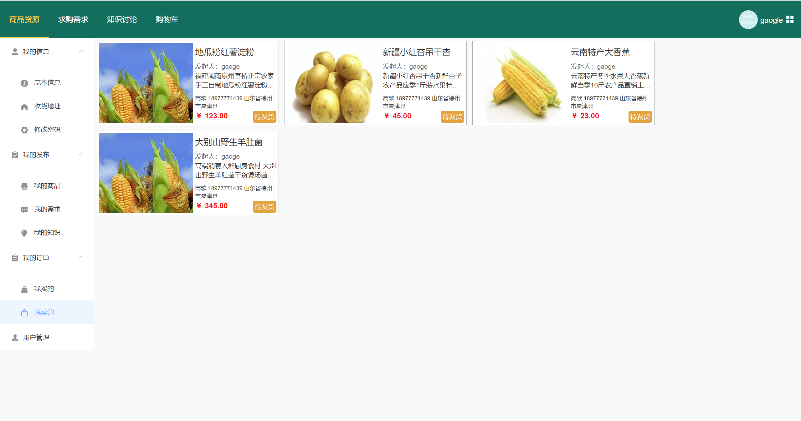
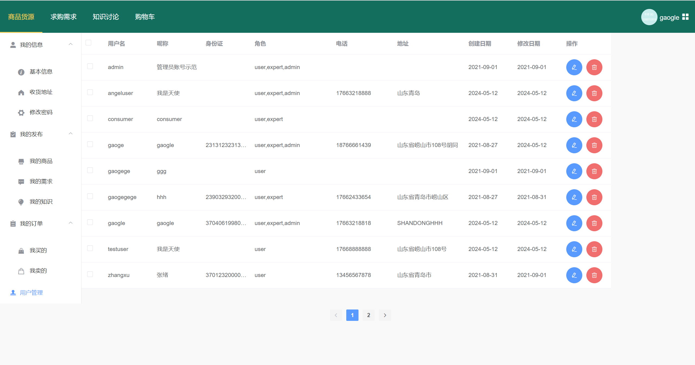

[   **系统使用演示视频** ](https://www.bilibili.com/video/BV16r42177r8/?spm_id_from=333.999.0.0&vd_source=eac6949bd2385c66c0a975d5765c99a5)
